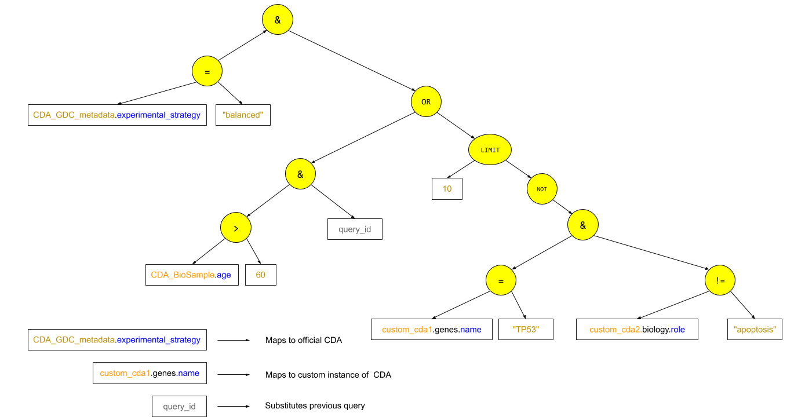

# CDA API Design and design documents

## Basic architecture


## Detail architecture


## Extension architecture


## Specification

[API specification in OpenAPI 3.0](api-definition.yml)

_The API is specified using [OpenAPI 3.0](http://spec.openapis.org/oas/v3.0.3)
syntax. It can be pre-viewed using VS Code plugins, or on the web with a variety
of web viewers. It is a text based format and can also be read on its own_




# Example API calls in pseudo code

```
query_id, result = cda.query.synchronous(query, result_params)
```

```
query_id = cda.query.asynchronous(query)
print(cda.query.status(query_id))
...
query_id, result = cda.query.result(query, result_params)
```

```
query_id1, query_analysis = cda.query.analyze(query)
query_id2, query_analysis = cda.query.analyze(query_that_contains_query1)
query_id3, summary = cda.query.summary(query_that_contains_query1)
# query_id3 = query_id2 becasue the CDA recognizes this as an existing, previous, query

_, result = cda.query.result(query_that_contains_query1, result_params)
```

```
query_id1, summary1 = cda.query.summary(query)
query_id2, summary2 = cda.query.summary(query_that_contains_query1)
_, result = cda.query.result(query_that_contains_query1, result_params)
```


# Query requirements
1. Queries do not require users to perform joins manually. They can treat the
   entire dataset as one large table with fixed (harmonized, namespaced,
   standardized) column names such that queries can made in abstract fashion, expressed as S-expressions.
1. Queries can span multiple CDA instances: table names are name spaced to
   enable this in a consistent and extendable fashion.
1. Each query node (expression) can have a sorting clause. This is to enable
   functions that limit the number of returned rows.

# API requirements
1. Queries can be done in a multi-step manner, each step refining the last.
1. Each query receives a unique query id. This query id can be used in other
   queries, when retrieving results, retrieving analysis of the query, or
   retrieving the status of the query.
1. When sending a query, the POST method is used for security and query
   size/complexity considerations.
1. Well typed objects are used to encapsulate the query. This eliminates
   ambiguity in query components that might happen without typing.


# Considerations and constraints

1. URL passed by client/browser should not be longer than 2048 characters to
   mitigate certain kinds of DDOS attacks ([1][url-length]). For this reason we use
   a query id when chaining queries and when referring to them, to avoid building
   up a very long URL. We also use a POST operation even though it's operation
   for idempotent queries is frowned upon. Arguably, most of the `/query` calls
   will not be strictly idempotent since they cache queries. 


[url-length]:
https://stackoverflow.com/questions/3091485/what-is-the-limit-on-querystring-get-url-parameters


# Unresolved questions

1. Should each query node have sorting instructions?


# References

1. https://www.kennethlange.com/7-tips-for-designing-a-better-rest-api/
1. https://dropbox.tech/developers/limitations-of-the-get-method-in-http
1. https://evertpot.com/dropbox-post-api/

